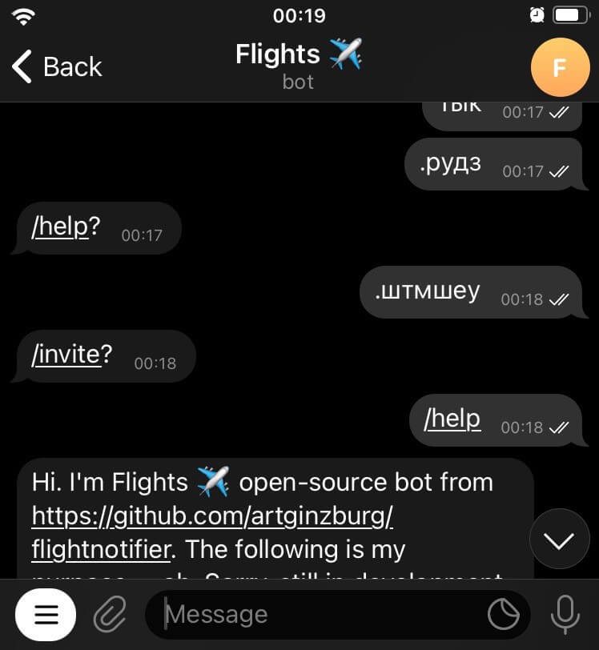

<h1 align="center">

  [telegraf][telegraf]-layoutfixer
</h1>

[](https://david-dm.org/artginzburg/telegraf-layoutfixer)
<a href="https://www.npmjs.com/package/telegraf-layoutfixer?activeTab=versions"></a>

<div align="center">

  Suggests layout typo fixes in Telegram chats (`.рудз` => `/help`)
</div>

## Quick start

First, run `npm i telegraf-layoutfixer`. Then, in your [Telegraf][telegraf] app:

```js
const { Telegraf } = require('telegraf')
const layoutfixer = require('telegraf-layoutfixer')

const bot = new Telegraf(process.env.BOT_TOKEN)

// ...

bot.use(layoutfixer())

bot.launch()
```

> layoutfixer should be connected last, after all the other text-related middlewares

## Preview



## Options

[Defaults](https://github.com/artginzburg/telegraf-layoutfixer/blob/main/defaultConfig.js) are shown below:

```js
require('telegraf-layoutfixer')({
  allowUnlistedCommands: false,
  validator: /^\w+$/,
  validInitiators: ['/', '.', '?', '÷', '\\', '|', '«', '»'],
  commands: undefined,
});
```

### allowUnlistedCommands (_default: `false`_)

Sets whether the bot should suggest fixes for commands that are not shown when the user starts typing `/`

### validator (_default: `/^\w+$/`_)

Sets a RegEx for validating layout-converted message as a command. Allows only words by default (a-z, A-Z, 0-9, _)

### validInitiators (_default: `['/', '.', '?', '÷', '\\', '|', '«', '»']`_)

Defines the first symbol of a message that tells layoutfixer the text should be interpreted as a command.

### commands (_default: `ctx.telegram.getMyCommands()`_)

Sets the commands that count as listed (if `allowUnlistedCommands` is `false`). Gets the bot's currently specified commands by default.

## Caught a Bug?

1. [Fork](https://help.github.com/articles/fork-a-repo/) this [repository](https://github.com/artginzburg/telegraf-layoutfixer/fork) to your own GitHub account and then [clone](https://help.github.com/articles/cloning-a-repository/) it to your local device
2. Link the package to the global module directory: `npm link`
3. Within the Telegraf app you want to test your local development instance of telegraf-layoutfixer, just link it to the dependencies: `npm link telegraf-layoutfixer`. Instead of the default one from npm, Node.js will now use your clone of the middleware!

[telegraf]: https://www.npmjs.com/package/telegraf
